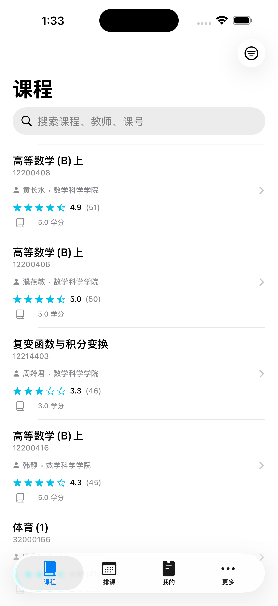
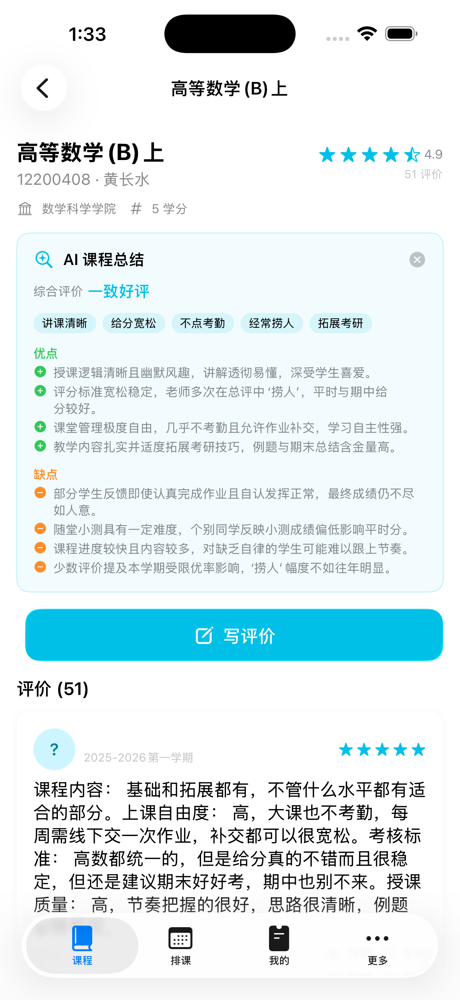
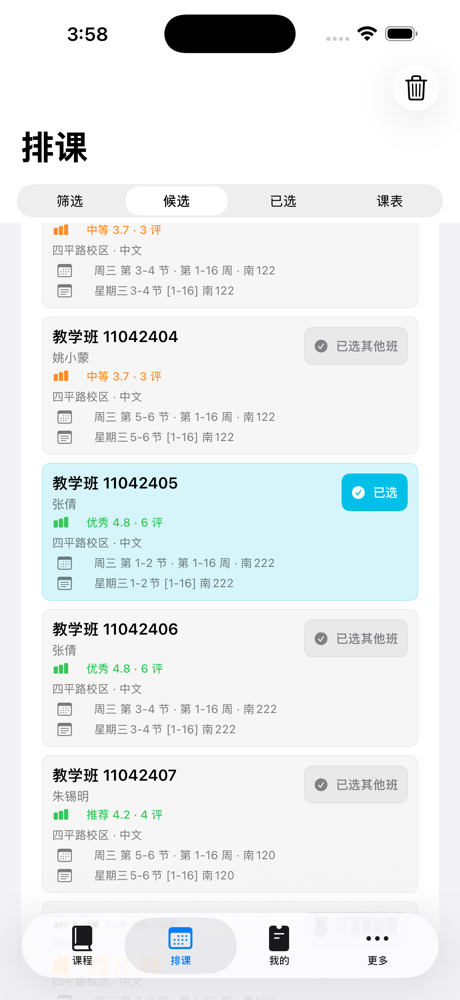
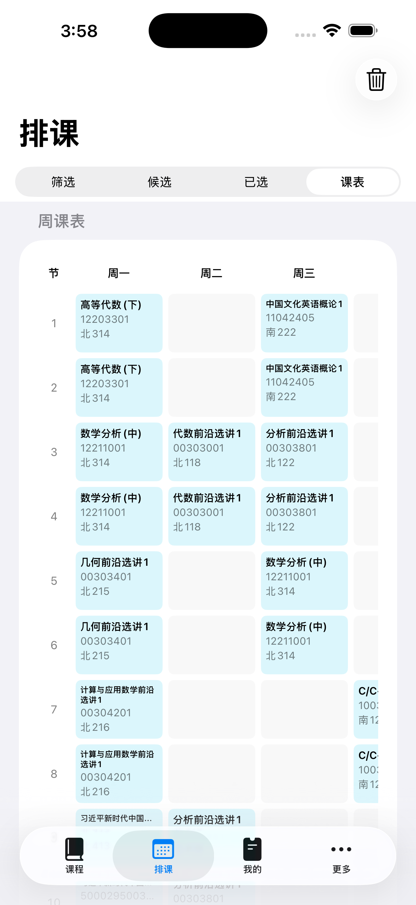
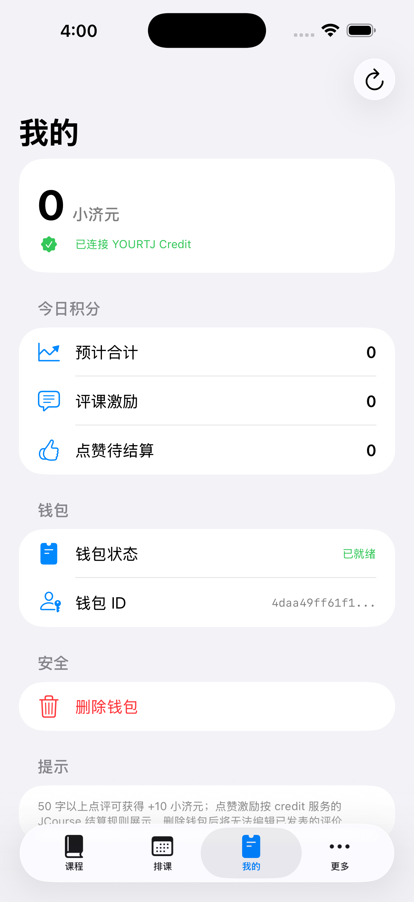

<p align="center">
  
</p>

<h1 align="center">YourTJ Course</h1>
<p align="center">
  同济大学选课社区 · 原生 iOS 客户端<br>
  SwiftUI + Liquid Glass · iOS 18+
</p>

<p align="center">
  <a href="https://testflight.apple.com/join/KkBg6quW">
    
  </a>
  
  
  
  
  
  
  
</p>

<p align="center">
  <a href="https://testflight.apple.com/join/KkBg6quW">TestFlight 公测</a> •
  <a href="#features">Features</a> •
  <a href="#architecture">Architecture</a> •
  <a href="#getting-started">Getting Started</a> •
  <a href="#project-structure">Project Structure</a> •
  <a href="#tech-stack">Tech Stack</a> •
  <a href="#safety--compliance">Safety</a>
</p>

---

**YourTJ Course** 是同济大学选课社区的官方 iOS 客户端。它以 SwiftUI 原生实现，采用 Liquid Glass 设计语言，直接调用 Cloudflare Workers 后端 API，提供课程浏览、评价分享、积分钱包、排课模拟器等功能。
> [立即通过 TestFlight 参与公测 →](https://testflight.apple.com/join/KkBg6quW)

> **YourTJ 产品矩阵** ·
> [Serverless（后端 API）](https://github.com/YourTongji/YourTJCourse-Serverless) ·
> [Flutter（跨端版）](https://github.com/YourTongji/YourTJCourse-Flutter) ·
> [Credit（积分服务）](https://github.com/YourTongji/YourTJ-Credit-Serverless) ·
> [Captcha（验证服务）](https://github.com/YourTongji/YourTJCaptcha) ·
> [HomePage（官网）](https://github.com/YourTongji/YourTJ-HomePage)

## Features

| 模块 | 功能 | 状态 |
|------|------|:---:|
| **启动闸门** | Captcha 验证（TongjiCaptcha / Turnstile WKWebView 桥接）、维护态检测、运行时状态检查 | `✅ Stable` |
| **课程浏览** | 无限滚动列表、关键词搜索（300ms 防抖）、只看有评价筛选、NavigationLink 进入详情 | `✅ Stable` |
| **课程详情** | 课程信息头、AI 总结卡片（含优缺点/关键词/共识/代表性评价）、Markdown 评价列表、点赞/取消、隐藏/举报、关联课程（同教师/同课号） | `✅ Stable` |
| **评价系统** | 写/编辑评价表单、评分选择、Markdown 正文、学期/昵称选填、Captcha 集成、HMAC edit_token 编辑鉴权 | `✅ Stable` |
| **积分钱包** | 学号+PIN 登录/注册（Credit 互通）、3 词助记词备份与恢复、远程余额/今日积分展示、Keychain 安全存储 | `✅ Stable` |
| **排课模拟器** | 学期切换、多维检索（课名/课号/教师/校区/院系）、专业课表、空段找课、教学班展开、冲突检测、周课表网格、收藏导入（按教学班关联）、教学班级评课/评分、已选持久化、同步引擎（教学班数据变更检测与冲突提示） | `✅ Stable` |
| **公告通知** | 运行时拉取、未读弹窗（interactiveDismissDisabled）、「我已知晓」标记已读、UserDefaults 持久化 | `✅ Stable` |
| **更多设置** | 公告列表、反馈留言板 / GitHub Issues 直达、EULA / 社区规范、关于页（含双仓库链接） | `✅ Stable` |

## Screenshots

| 📚 课程列表 | 🤖 AI 课程总结 | 📅 排课模拟器 |
|:---:|:---:|:---:|
|  |  |  |

| 🔍 排课检索 | 💰 积分钱包 |
|:---:|:---:|
|  |  |

## Architecture

Pure **MV** (Model-View) architecture with `@Observable`, no heavy MVVM framework.

```
┌─────────────────────────────────────────┐
│  App  (@main, RootView, TabView, DI)    │
├─────────────────────────────────────────┤
│  Features                               │
│  ┌────────┬────────┬────────┬────────┐  │
│  │Catalog │Course  │ Review │ Wallet │  │
│  │        │Detail  │        │        │  │
│  ├────────┼────────┼────────┼────────┤  │
│  │Scheduler│Settings│Startup │        │  │
│  │         │        │ Gate   │        │  │
│  └────────┴────────┴────────┴────────┘  │
├─────────────────────────────────────────┤
│  DataKit  (APIClient, Repositories,     │
│           Keychain, HMAC, Mnemonic)     │
├─────────────────────────────────────────┤
│  DomainKit (pure models, no UI deps)    │
├─────────────────────────────────────────┤
│  DesignSystem + Platform                │
│  (Liquid Glass, Markdown, Captcha, Log) │
└─────────────────────────────────────────┘
```

**Key design decisions:**

- **MV not MVVM** — `@Observable` Store holds state and intent methods; View subscribes directly. No boilerplate protocols.
- **No network dependencies** — `URLSession` with `URLCache` handling `Cache-Control` + `stale-while-revalidate` for instant second-load.
- **Repository + DI** — via initializer injection for testability. Domain logic stays pure where possible.
- **Strict Concurrency** — Swift 6 with complete concurrency checking. `@MainActor` for UI, `actor` for shared mutable state.

## Getting Started

### Prerequisites

- Xcode 16+
- iOS 17+ deployment target
- (Optional) Local backend for development

### Setup

```bash
# Generate Xcode project via XcodeGen
cd YourTJCourse-iOS
xcodegen generate --spec project.yml --project .

# Open project
open YourTJCourse.xcodeproj
```

Select **iPhone 16 Pro** simulator and hit Run. SPM will automatically resolve dependencies (swift-markdown-ui).

### API Configuration

API base URLs are managed via `Config/*.xcconfig`:

| Environment | API Base | Credit Base |
|-------------|----------|-------------|
| **Debug** | `http://127.0.0.1:8787` | `https://core.credit.yourtj.de` |
| **Release** | `https://jcourse.yourtj.de` | `https://core.credit.yourtj.de` |

> ⚠️ `xcconfig` uses `//` for comments. URL double slashes must be escaped: `API_BASE = http:/$()/127.0.0.1:8787`
> ⚠️ Debug ATS is relaxed for local `http://` only; Release uses HTTPS exclusively.

### Build

```bash
# Build for simulator
xcodebuild -scheme YourTJCourse -destination 'platform=iOS Simulator,name=iPhone 16 Pro' build

# Run tests
xcodebuild -scheme YourTJCourse -destination 'platform=iOS Simulator,name=iPhone 16 Pro' test

# Package unit tests
swift test --package-path Packages/DomainKit
swift test --package-path Packages/DataKit
```

## Project Structure

```
YourTJCourse-iOS/
├── App/                              # Thin app target
│   ├── YourTJCourseApp.swift         # @main, RootView, MainTabView, announcements
│   ├── Info.plist                    # API_BASE, ATS config
│   └── Assets.xcassets/
│       ├── AppIcon.appiconset/       # Cyan "YTJ" cat icon
│       └── AccentColor.colorset/
│
├── Packages/
│   ├── DomainKit/                    # Pure domain models
│   │   ├── Course.swift              # Course, CourseDetail, RelatedCourses
│   │   ├── Review.swift              # Review
│   │   ├── AiSummary.swift           # AiSummaryData, AiSummaryResponse
│   │   ├── Wallet.swift              # WalletBalance, WalletSummary, CreditWallet
│   │   ├── RuntimeState.swift        # MaintenanceState, Announcement, etc.
│   │   ├── PaginatedResponse.swift   # Generic paginated response
│   │   ├── Semester.swift            # Semester utilities
│   │   └── ReportReason.swift        # Report enum (App Store compliance)
│   │
│   ├── DataKit/                      # Networking & data layer
│   │   ├── APIClient.swift           # URLSession-based HTTP client
│   │   ├── APIConfig.swift            # Build-time config (API_BASE, clientId)
│   │   ├── APIError.swift            # Typed errors
│   │   ├── Repositories/             # CourseRepository, ReviewRepository, etc.
│   │   ├── Keychain/                 # KeychainManager with biometric support
│   │   ├── HMAC/                     # HMACHelper (edit_token computation)
│   │   ├── Credit/                   # CreditAPIClient (separate base URL)
│   │   └── Utilities/                # BIP39Wordlist, MnemonicHelper
│   │
│   ├── DesignSystem/                 # Liquid Glass & components
│   │   ├── Theme.swift               # Cyan brand colors, typography tokens
│   │   ├── LiquidGlass.swift         # GlassEffect modifier, card styles
│   │   └── Components/               # CourseCard, RatingView, EmptyState, etc.
│   │
│   ├── Platform/                     # Cross-cutting utilities
│   │   ├── Markdown/                 # swift-markdown-ui renderer
│   │   ├── Captcha/                  # WKWebView bridge, TongjiCaptcha, Turnstile
│   │   ├── Logger/                   # os.Logger wrapper
│   │   └── Utilities/                # AppVersion, Constants
│   │
│   └── Features/                     # All feature modules
│       ├── Catalog/                  # Course list, search w/ debounce, filter sheet
│       ├── CourseDetail/             # Detail header, AI summary, review cards
│       ├── Review/                   # Write/edit form, captcha, HMAC edit_token
│       ├── Wallet/                   # Student ID+PIN login/register, Credit integration
│       ├── Settings/                 # Announcements, EULA, guidelines, feedback, about
│       ├── Startup/                  # Gate, captcha verification, maintenance detection
│       └── SchedulerStub.swift       # typealias → SchedulerView (full scheduler impl.)
│
├── Config/                           # xcconfig files (Debug/Release)
├── AGENTS.md                         # AI agent development guidelines
└── project.yml                       # XcodeGen project specification
```

## Tech Stack

| Layer | Choice |
|-------|--------|
| Language | Swift 6 (strict concurrency) |
| UI | SwiftUI, iOS 17+ (Liquid Glass on iOS 26+) |
| State | `@Observable` / `@Environment` (MV) |
| Async | Swift Concurrency (`async/await`, `actor`, `@MainActor`) |
| Networking | URLSession (zero third-party libs) |
| Cryptography | CryptoKit (HMAC-SHA256) |
| Secure Storage | Keychain (with biometric protection) |
| Markdown | swift-markdown-ui |
| Captcha | WKWebView bridge (Turnstile / TongjiCaptcha) |
| Package Manager | Swift Package Manager |
| Project Generation | XcodeGen |

## Safety & Compliance

- **🔑 Keychain only** — Wallet userSecret and mnemonics are stored exclusively in Keychain with optional biometric protection. Never in UserDefaults, logs, or plaintext files.
- **🛡️ No XSS vector** — Reviews rendered natively via `AttributedString`/`swift-markdown-ui`. WebView is reserved solely for captcha.
- **🔐 HMAC edit token** — `edit_token = HMAC-SHA256(userSecret, "jcourse:edit-review:" + reviewId)`, computed client-side via CryptoKit. Private key never leaves the device.
- **🔒 HTTPS only** — Release builds enforce HTTPS. ATS is relaxed only for `127.0.0.1` in Debug.
- **📋 UGC compliance (App Store Guideline 1.2)** — Report button on every review, hide individual reviews, EULA and Community Guidelines presented in-app.
- **📍 No fingerprinting** — Like `clientId` is a random UUID persisted locally. No device fingerprint collection.

## License

© 2026 YourTJ. All rights reserved.
